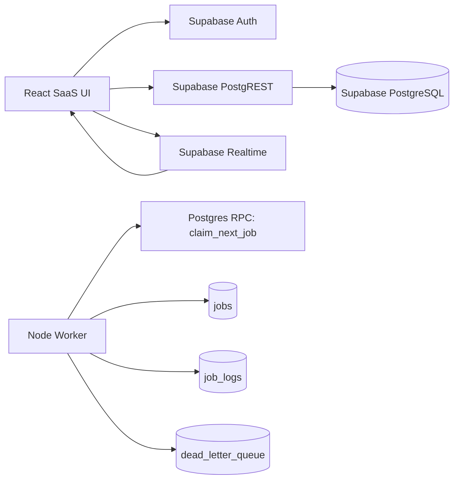

# Architecture

The frontend is a Vite React app that reads and mutates Supabase tables through a shared service layer. Supabase Auth protects routes and Row Level Security scopes user access to organization membership.

The worker is a separate Node process. It registers itself, heartbeats periodically, atomically claims available jobs with `claim_next_job`, executes handlers from the registry, and records completion, retry, or dead-letter transitions through RPC functions.
