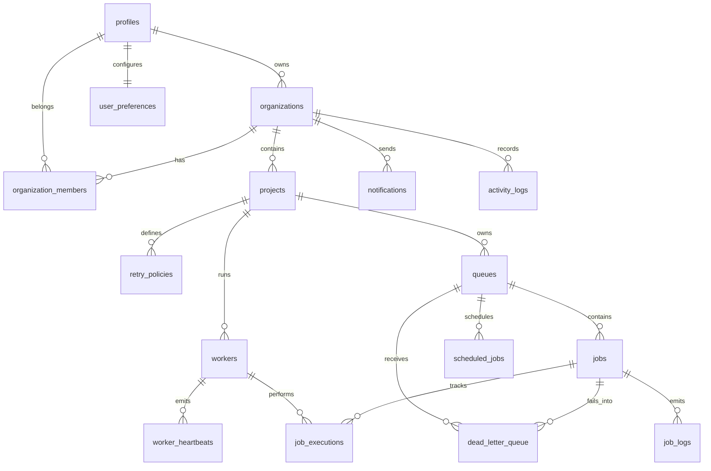

# ER Diagram

```mermaid
erDiagram
  profiles ||--o{ organizations : owns
  profiles ||--o{ organization_members : belongs
  organizations ||--o{ organization_members : has
  organizations ||--o{ projects : contains
  projects ||--o{ retry_policies : defines
  projects ||--o{ queues : owns
  projects ||--o{ workers : runs
  queues ||--o{ jobs : contains
  queues ||--o{ scheduled_jobs : schedules
  queues ||--o{ dead_letter_queue : receives
  workers ||--o{ worker_heartbeats : emits
  workers ||--o{ job_executions : performs
  jobs ||--o{ job_logs : emits
  jobs ||--o{ job_executions : tracks
  jobs ||--o{ dead_letter_queue : fails_into
  organizations ||--o{ notifications : sends
  organizations ||--o{ activity_logs : records
  profiles ||--|| user_preferences : configures
```
